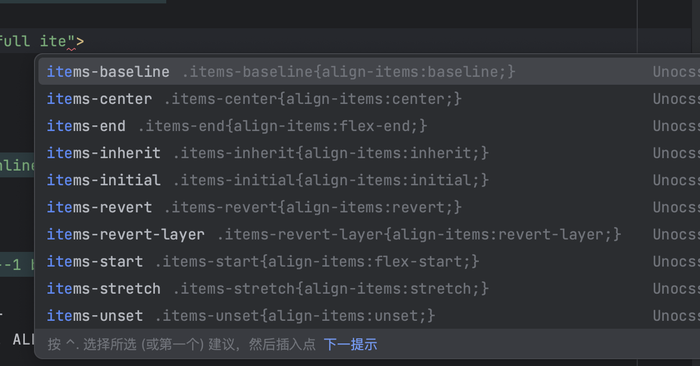
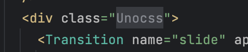

    

# Unocss Intellij

> <a href="https://github.com/unocss/unocss">Unocss</a> Support for Intellij Based IDEs

> ⚠ Working In Progress, Not ready for Use!

> 为了确保上架之前的稳定性，寻求早期测试者，如果你有兴趣，请联系加QQ群 720240934

## Features

- Auto complete
- Syntax highlight
- Css hover preview
- Code Folding

## Screenshots

| Auto Complete                               | Css Doc                                        | Icon/Color Preview                            | Fold                                  |
|---------------------------------------------|------------------------------------------------|-----------------------------------------------|---------------------------------------|
|  |  |  |  |

## Contribution

See [developer.md](docs/developer.md)

## License

[MIT](LICENSE) License