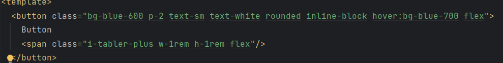
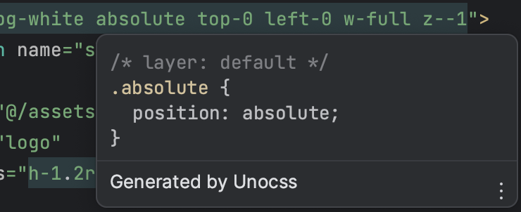
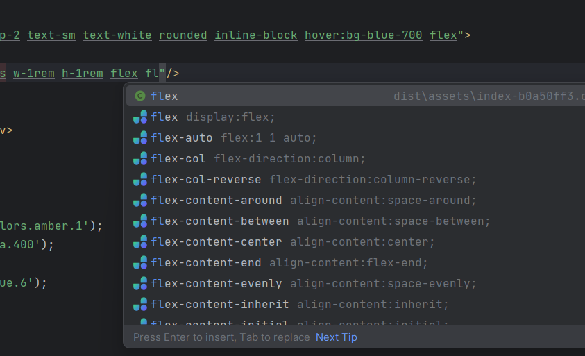
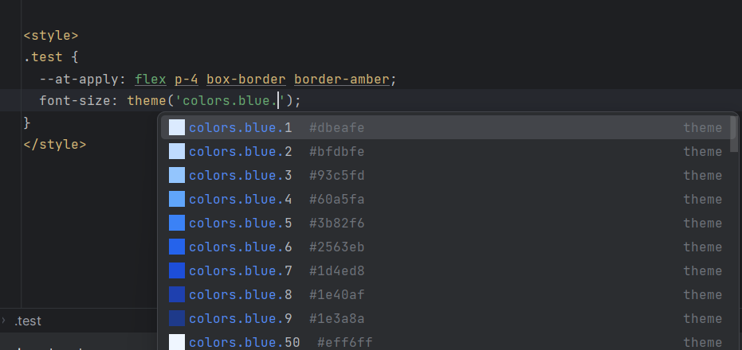
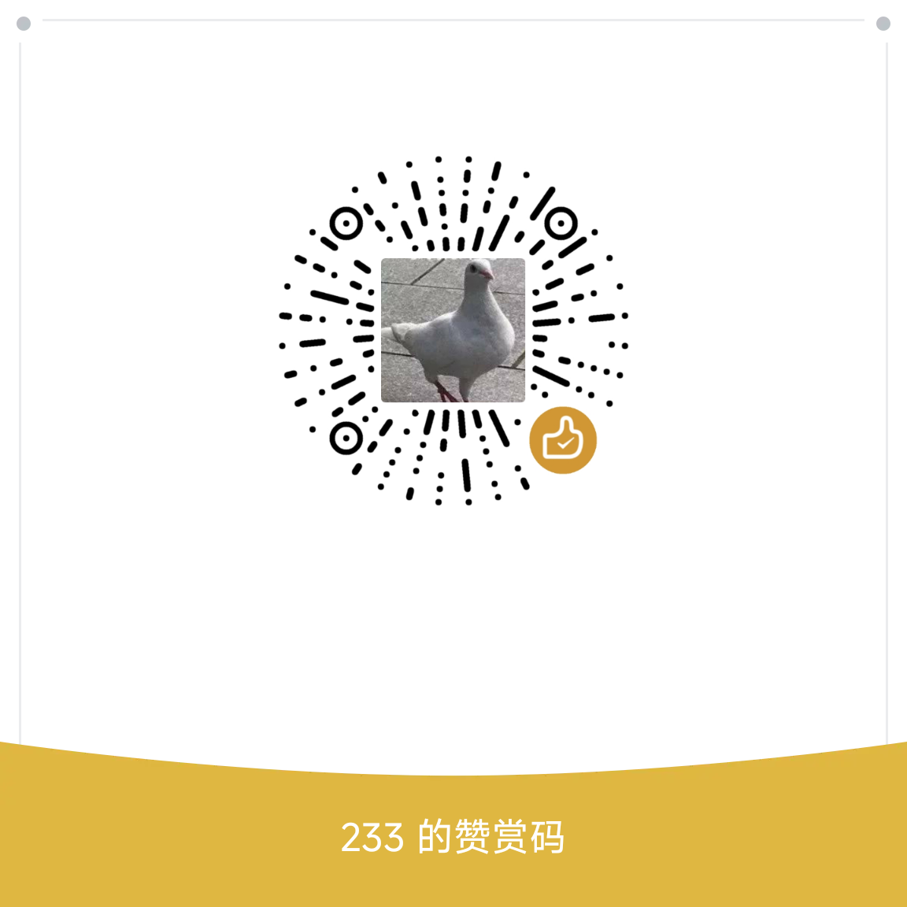

    

# Unocss Intellij

> <a href="https://github.com/unocss/unocss">Unocss</a> Support for Intellij Based IDEs

## Features

- Auto complete
- Syntax highlight
- Documentation
- Directive support (e.g. `@apply, @screen, @theme`)
- Attributify support
- Line marker for colors and icons
- Reference Lookup for class name and theme directive

## Screenshots
### Highlighting

### Documentation

### Auto Complete

### Directive

## Contribution

See [developer.md](docs/developer.md)

### Donation

## License

[MIT](LICENSE) License
